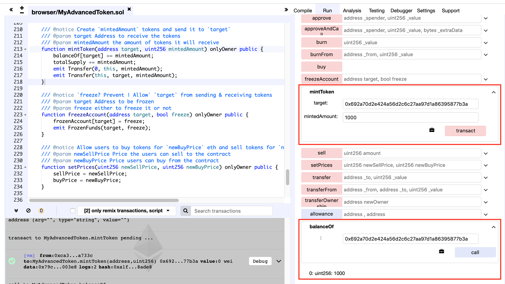
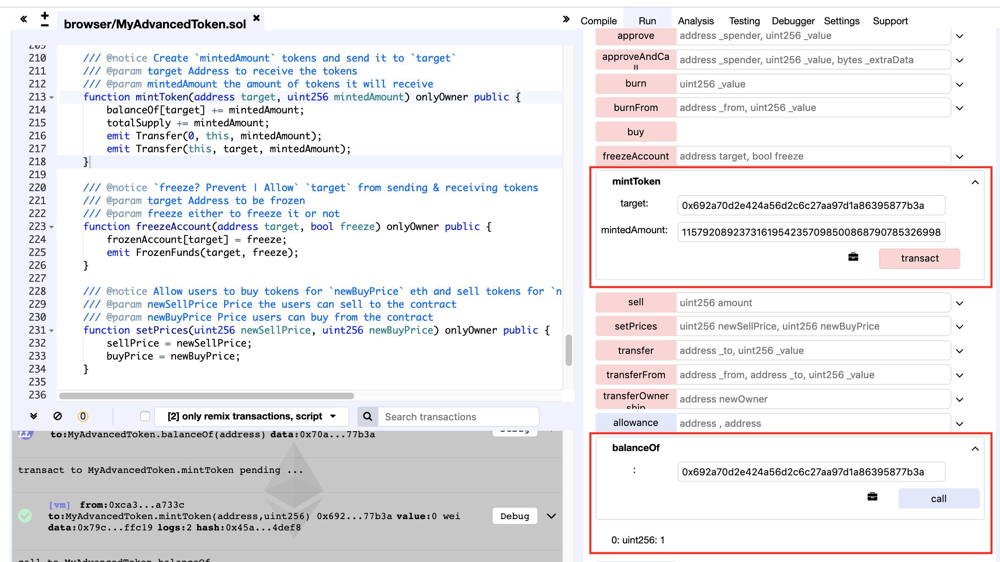

### contract address
https://etherscan.io/address/0x577f04d8e049cc9306d4becf25cec6e5c4de214a#code

### code with vulnerabilities
```
    /// @notice Create `mintedAmount` tokens and send it to `target`
    /// @param target Address to receive the tokens
    /// @param mintedAmount the amount of tokens it will receive
    function mintToken(address target, uint256 mintedAmount) onlyOwner public {
        balanceOf[target] += mintedAmount;
        totalSupply += mintedAmount;
        Transfer(0, this, mintedAmount);
        Transfer(this, target, mintedAmount);
    }
```

The mintToken function of BSC is vulnerable to the integer overflow vulnerability. The balance of arbitrary address could be manipulated hostilely by the contract creator. After adding 'mintedAmount' to the 'balanceOf[target]', the result value are not checked carefully which could cause an integer overflow.

### PoC

The exploit of this vulnerability use the same method as described in [expoit of MyAdvancedToken](https://github.com/neo1100/ethereum_smart_contracts/tree/master/0x02dc6487991227a5cd580f88e6c32f560649d03d_MyAdvancedToken). Below is the exploit method of that vulnverability.

#### step 1
Call mintToken(), assigning 1000 tokens to the address 0x692a70d2e424a56d2c6c27aa97d1a86395877b3a. After the call, the balance of the target address is 1000.</br>


#### step 2
Call mintToken() again, now assigning 2**256 - 999 (which is 115792089237316195423570985008687907853269984665640564039457584007913129638937) to the target address. After the call, the balance of the target address is 1.</br>


The balance of the target address is tampered with by the contract creater.
